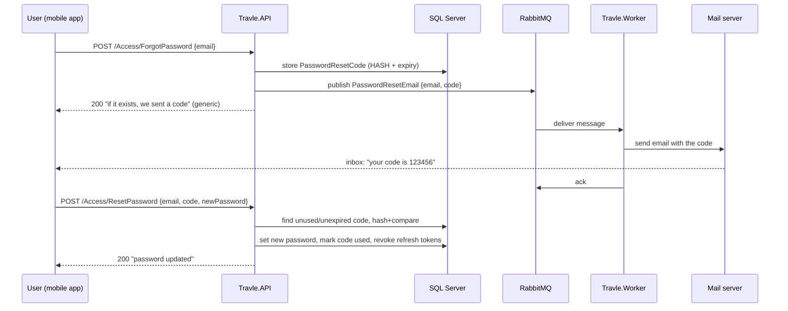

# Email, RabbitMQ & SMTP in Travle — how it will work

> A personal explainer (not part of the graded docs). Move it wherever you like.
> It walks through **password reset** end-to-end, then shows how the *same* pipeline
> serves every other email (booking confirmed, refund issued, role decision, 24h reminders).

---

## 1. The mental model in one paragraph

Sending an email is **slow and can fail** (the SMTP server might be down, throttling, or just
takes a second or two). We must never make a user's HTTP request wait on that. So we split the work
across **two programs**: the **API** decides *that* an email should be sent and drops a small
message into a **queue** (RabbitMQ); the **Worker** — a completely separate process/container —
picks messages off that queue whenever it can and actually talks to the **SMTP** server. The queue
sits in the middle as a durable buffer: if the worker is busy or crashes, messages wait safely until
it's back. This is also a hard course requirement (§F: a second service that does *real* work, with
RabbitMQ as the broker).

```
  ┌──────────┐   1. publish        ┌────────────┐   2. deliver      ┌───────────┐   3. SMTP     ┌──────────┐
  │  Travle  │ ─────────────────▶  │  RabbitMQ  │ ───────────────▶  │  Travle   │ ───────────▶  │  Mail    │
  │   API    │   "send this email" │   (queue)  │   (one message)   │  Worker   │   send mail   │  server  │
  └──────────┘                     └────────────┘                   └───────────┘               └──────────┘
      │                                                                                              │
      │ also: write PasswordResetCode (hashed) to the DB                                             ▼
      ▼                                                                                        user's inbox
   SQL Server
```

**API and Worker never call each other directly.** Their only contact is the queue. That's the
whole point — they can start, stop, crash, and scale independently.

---

## 2. The four moving parts

| Part | Where it lives | Responsibility |
|---|---|---|
| **Publisher** | `Travle.WebAPI` (or `Travle.Services/Messaging`) | Serialize a small message and push it to RabbitMQ. **One long-lived connection** (course §A.1 — never a new connection per publish). |
| **Broker** | `travle-rabbitmq` container (already in compose) | Holds messages in a **durable queue** until a consumer acks them. Survives worker restarts. |
| **Consumer** | `Travle.Worker` | Subscribes to the queue (`AsyncEventingBasicConsumer`), deserializes each message, sends the email, **acks** on success. Retries with backoff on failure. |
| **Email sender** | `Travle.Worker` (`EmailService`, using **MailKit**) | Opens an SMTP connection and sends the rendered message. |

RabbitMQ terms you'll meet:

- **Queue** — a named mailbox messages sit in (e.g. `travle.emails`). Declared **durable** so it
  survives a broker restart; messages published **persistent** so they're written to disk.
- **Exchange** — the router messages are published *to*; it decides which queue(s) they land in.
  For our simple case the **default exchange** + routing key = queue name is enough (publish straight
  to `travle.emails`). If we later want fan-out to several consumers we introduce a named exchange.
- **Ack / Nack** — the consumer tells the broker "I've handled this" (ack → message deleted) or
  "I failed" (nack → requeue or dead-letter). We use **manual ack** so a crash mid-send doesn't
  lose the email — an unacked message is redelivered.
- **Prefetch** — how many unacked messages one consumer takes at once (we'll keep this small, e.g. 1–10,
  so work spreads evenly and a slow email doesn't hog a batch).

---

## 3. Password reset — the full journey

There are **two** API calls (request, then confirm) with the email in between.

### Step A — user asks for a reset  (`POST /Access/ForgotPassword`)

Request body: `{ "email": "someone@example.com" }`

The API:

1. Looks up the user by email. **Whether or not it finds one, it returns the same `200 OK`**
   with a generic message ("If that email exists, a reset code has been sent"). This prevents
   *account enumeration* — an attacker can't use this endpoint to discover which emails are registered.
2. If the user exists:
   - Generates a **random code** using `System.Security.Cryptography.RandomNumberGenerator`
     (course §A.3 — never `System.Random`). This is the plaintext the user will type/click.
   - **Hashes** that code and stores the hash + an **expiry** (e.g. now + 15–30 min) in the
     `PasswordResetCode` table. **The plaintext code is never stored** — exactly like a password.
     (The entity already exists: `UserId`, `CodeHash`, `ExpiresAt`, `UsedAt?`.)
   - Optionally invalidates any previous unused codes for that user (one live code at a time).
   - **Publishes** a `PasswordResetEmail` message to RabbitMQ carrying the recipient email + the
     **plaintext** code (or a reset link containing it). The plaintext lives only in the message and
     the email, never in our DB.

> Why hash the code? Same reason as passwords: if the DB leaks, the stored hashes are useless — an
> attacker can't turn them back into working codes. When the user submits their code we hash *that*
> and compare hashes.

### Step B — the worker sends the email  (asynchronous, out of band)

The worker's consumer receives the `PasswordResetEmail` message, renders an email body
("Your Travle reset code is `123456`, valid for 20 minutes"), and sends it via SMTP with MailKit.
On success it **acks**; on failure it retries with exponential backoff (1s → 2s → 4s → 8s, course
§A.1) and, if it still fails, dead-letters/logs so nothing vanishes silently.

### Step C — user submits the code  (`POST /Access/ResetPassword`)

Request body: `{ "email": ..., "code": "123456", "newPassword": ... }`

The API:

1. Finds the user's **most recent, unused, unexpired** `PasswordResetCode`
   (`UsedAt == null && ExpiresAt > now`).
2. Hashes the submitted `code` and compares to `CodeHash`. Mismatch/expired/used → generic 400.
3. On match:
   - Sets the new password (hash + fresh salt via the same `CryptoService`).
   - Marks the code **used** (`UsedAt = now`) so it can't be replayed.
   - **Revokes all the user's refresh tokens** (a password reset should log out every session).
   - (Optionally) publishes a "password changed" confirmation email.

### The sequence, visually



---

## 4. SMTP — what it is and how to configure it for the demo

**SMTP** (Simple Mail Transfer Protocol) is just the protocol mail servers speak. To send mail you
point MailKit at a host+port and authenticate. You do **not** run your own mail server — you use an
existing one. Three practical options:

| Option | Good for | Notes |
|---|---|---|
| **Mailtrap** (sandbox) | **Demo / grading** ✅ | A fake inbox in the cloud. Emails never reach real people; you view them in Mailtrap's web UI. Zero risk of spamming, perfect to show "the reset email arrives". Free tier is enough. |
| **smtp4dev / Papercut / MailHog** | Local dev | A tiny SMTP server you run locally (or as a compose service) that captures mail in a local web UI. No internet needed. |
| **Gmail (App Password)** | Real delivery | Works, but needs a Google *app password* (not your login), and Google can rate-limit/flag it. Fine, but heavier to set up than Mailtrap. |

The config keys are already reserved (commented) in `.env.example`:

```dotenv
SMTP_HOST=sandbox.smtp.mailtrap.io      # from your provider
SMTP_PORT=587                            # 587 = STARTTLS (typical), 465 = implicit TLS
SMTP_USERNAME=...                        # from your provider
SMTP_PASSWORD=...                        # from your provider
SMTP_FROM=no-reply@travle.com            # the "From" address shown to the user
```

When we implement this, those become **real** values in your `.env`, get mapped into the
**worker** container in `docker-compose.yml` (as `Smtp__Host`, `Smtp__Port`, …, just like the JWT and
RabbitMQ vars already are), and the worker binds them to an options class. **Nothing SMTP-related
touches the API** — the API only knows about RabbitMQ. That keeps the "secret sending credentials"
in exactly one place: the worker (course §G, centralized config).

> For grading, Mailtrap is the sweet spot: the grader can watch the reset email land in a shared
> inbox without any real mailbox setup, and there's no chance of accidentally emailing strangers.

---

## 5. Why this generalizes — every other email is the same shape

Password reset is the *template*. Every other notification email in Travle is the identical
publish → queue → consume → send pipeline; only the **message type** and **body** change:

- Booking confirmed / rejected / cancelled / expired
- Payment succeeded / refund issued
- Role application approved / rejected
- 24-hour tour reminder (published by a scheduler in the API)

Two ways to model the messages (we'll pick one when we build it):

1. **One message type per event** (`BookingConfirmedEmail`, `RefundIssuedEmail`, …) — very explicit,
   each carries exactly the data its template needs. Slightly more classes.
2. **One generic `SendEmailMessage`** `{ to, templateId, model }` — the worker owns all templates and
   picks one by `templateId`. Fewer message types, templates centralized in the worker.

Either way, the API's job is always the same three lines: *build the message, publish it, return.*
And the worker's job is always: *consume, render, send, ack (retry on failure)*. Once the pipeline
exists for password reset, adding "send an email when a booking is confirmed" is a few lines.

---

## 6. What we build when we implement this (checklist preview)

**Shared / infra**
- A message contract (a small DTO, e.g. in `Travle.Model` or a shared messaging namespace both
  projects can see).
- A **RabbitMQ connection provider** registered as a **singleton** (§A.1) in both API and worker.

**API side (publisher)**
- `IEmailPublisher` / `RabbitMqEmailPublisher` in `Travle.Services/Messaging`.
- Wire `RabbitMq__*` env into the **API** container in compose (right now only the worker has them).
- `POST /Access/ForgotPassword` and `POST /Access/ResetPassword` endpoints + services + validators.

**Worker side (consumer)**
- An `AsyncEventingBasicConsumer` hosted service that subscribes to `travle.emails`.
- `IEmailService` / `MailKitEmailService` reading `Smtp__*` options.
- Retry with exponential backoff, manual ack, logging on every failure (§A.1 — never die silently).

**Config**
- Fill the `SMTP_*` keys in `.env` / `.env.example` **once** — compose maps them into the worker as
  `Smtp__*`, and local runs get them through `EnvironmentConfigurationAliases` (see
  `02-architecture-and-code-rules.md` §config). Map `Smtp__*` into the worker in
  compose; add `RabbitMq__*` to the API service.

**Scheduler cleanup (later)**
- The `IHostedService` scheduler purges expired/used `PasswordResetCode` rows.

---

### TL;DR
The API never sends email — it writes a hashed reset code to the DB and drops a message on RabbitMQ,
then returns immediately (with a deliberately vague response so nobody can probe which emails exist).
The separate worker container picks the message up and does the slow SMTP work, retrying if the mail
server misbehaves. The user gets a code, submits it, and the API verifies the hash, sets the new
password, marks the code used, and logs out all their sessions. Every other email in the app rides
the exact same rails.
