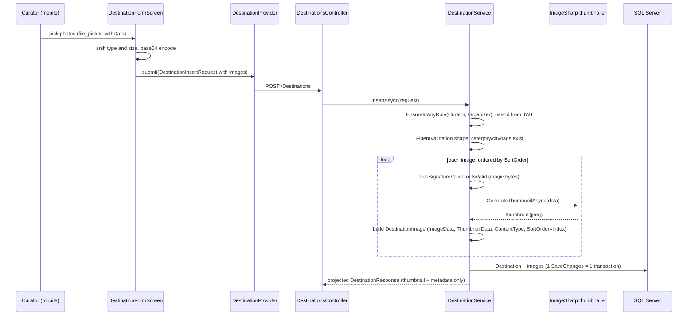

# Travle — Destination Image Flow (personal reference)

A detailed walkthrough of how a destination's images move through the system: from
the phone's file picker, over the wire, through validation and thumbnailing on the
server, into the database, and back out to the screen. Written so you can defend
every decision.

> **The one-line mental model:** full image bytes live in the DB; **lists carry only a
> small thumbnail inline**, and the **full image is fetched from a dedicated endpoint**;
> the client **decodes each image once** and caches it. The client **never** produces the
> thumbnail — the server does, from the bytes it can trust.

---

## 1. The storage — `DestinationImage` entity

`Backend/Travle.Services/Database/DestinationImage.cs` (one row per image, child of a
destination, cascades away with it):

| Column | Meaning |
|---|---|
| `ImageData` (`byte[]`) | the **full** original image bytes |
| `ThumbnailData` (`byte[]`) | a small (~15–30 KB) **JPEG** the server generated |
| `ContentType` (`string`) | the content type of **`ImageData`** — `image/jpeg` or `image/png` (the original) |
| `SortOrder` (`int`) | position in the destination's gallery; **`SortOrder == 0` is the cover** |

Config: `Backend/Travle.Services/Database/Configurations/DestinationImageConfiguration.cs`
— `ImageData`/`ThumbnailData`/`ContentType` are required, and the FK to `Destination`
is `OnDelete(Cascade)` (delete a destination → its images go with it).

Two byte columns is deliberate: the thumbnail exists so **list screens never have to
ship (or the DB never has to read) the megabyte-sized `ImageData`**.

---

## 2. The DTOs (the types you asked about)

DTOs are the contract between the API and the Flutter client. `byte[]` serialises to/from
a **base64 string** on the wire (ASP.NET Core's System.Text.Json does this automatically),
so every "bytes" field below is a base64 string in the JSON.

### 2a. `DestinationImageRequest` — *new image on submit*
`Backend/Travle.Model/Requests/DestinationImageRequest.cs`

```
Data (byte[])      – the raw image bytes (base64 over the wire)
ContentType (str)  – what the client claims it is (image/jpeg | image/png)
SortOrder (int)    – where it should sit in the gallery
```

Used inside `DestinationInsertRequest.Images` (the whole submission). The client sends
**only** the source bytes + a declared type. It does **not** send a thumbnail — the server
verifies the bytes and generates the thumbnail itself (see §3). `ContentType` is only a
*claim*; the server re-checks it against the actual bytes (magic-byte sniffing).

### 2b. `DestinationImageEditItem` — *one entry in an edit's desired image set*
`Backend/Travle.Model/Requests/DestinationImageEditItem.cs`

```
Id (int?)          – set  → keep this existing image (only its SortOrder may change)
Data (byte[]?)     – set  → this is a NEW image to add
ContentType (str?) – set with Data → the new image's declared type
SortOrder (int)    – desired position
```

The rule is **exactly one of `Id` / `Data`** is set per item (enforced by
`DestinationImageEditItemValidator`). This single list expresses **keep + add + remove +
reorder** in one request:

- an item **with `Id`** → keep that image;
- an item **with `Data`** → add a new image;
- an existing image whose id is **absent** from the list → **delete** it;
- the list **order / `SortOrder`** → the new gallery order.

Used inside `DestinationUpdateRequest.Images`. Why not separate "add"/"remove"/"reorder"
calls? Because one desired-state payload is atomic, simpler to reason about, and lets the
server reconcile in a single transaction (see §5).

### 2c. `DestinationImageResponse` — *image metadata on read*
`Backend/Travle.Model/Responses/DestinationImageResponse.cs`

```
Id (int)           – used to fetch the full bytes from the image endpoint
ContentType (str)  – the original image's type
SortOrder (int)    – gallery order
```

**No bytes here.** It's the lightweight descriptor a detail screen uses to build the
gallery (and the edit form uses to know which images already exist). The bytes come from
the dedicated endpoint, keyed by `Id`.

### 2d. `DestinationResponse` — the inline thumbnail
`Backend/Travle.Model/Responses/DestinationResponse.cs`

```
PrimaryThumbnail (byte[]?)          – the cover image's THUMBNAIL bytes, inline
PrimaryThumbnailContentType (str?)  – always "image/jpeg" when present
Images (List<DestinationImageResponse>) – metadata for every image
```

`PrimaryThumbnail` is the **only** image bytes ever carried in a list/detail payload —
the small cover thumbnail, so a card can render immediately without an extra request.
Everything else about images is metadata. Full bytes always come from the endpoint.

### 2e. Server helpers
- `Backend/Travle.Services/Security/FileSignatureValidator.cs` — checks the **leading
  "magic bytes"** of the file match the declared type (JPEG starts `FF D8 FF`, PNG starts
  `89 50 4E 47 …`). Trusting the declared content type or a file extension is a classic
  upload vulnerability; this is the course's "validate MIME **and** magic bytes" rule.
- `Backend/Travle.Services/Imaging/IThumbnailGenerator.cs` +
  `ImageSharpThumbnailGenerator.cs` — decode → downscale (longest edge ~400 px, aspect
  preserved, never upscaled) → re-encode **JPEG** (~q80). Backed by **SixLabors.ImageSharp**
  (fully managed; runs in the Linux API container with no native GDI+ dependency). Also
  mints the solid-colour **placeholder** images the seed uses so every seeded destination
  has a picture on first run.

### 2f. Client helpers
- `UI/travle_core/lib/src/utils/image_codec.dart` — `encode` (bytes → base64),
  `decode` (base64 → bytes, null-safe), `sniffContentType` (client-side magic-byte check,
  mirrors the server so bad files are rejected early), plus the accepted-types and
  5 MB size limits.
- `UI/travle_ui/lib/src/widgets/thumbnail_image.dart` — `ThumbnailImage`: decodes its
  base64 **once** in `initState`/`didUpdateWidget` (never in `build`) and renders
  `Image.memory`. This is the rule "never base64-decode inside `build()`".
- `_ImageItem` inside `UI/travle_mobile/lib/screens/profile/destination_form_screen.dart`
  — the form's per-image model: either an existing image (`existingId` + preview bytes it
  fetched) or a newly picked one (`base64` + `contentType` + the picked bytes). Carries a
  stable `key` so the reorderable list can track it.

---

## 3. Flow A — submitting a destination with images (create)



Key points:
- The **submitter comes from the JWT**, never the request; status is forced to `Pending`.
- Images are re-ordered by their `SortOrder` and stored with `SortOrder = 0,1,2,…`; index 0
  becomes the cover.
- If a file has a valid magic-byte header but is actually corrupt, ImageSharp's decode
  throws `ImageFormatException`, which the thumbnailer translates into a `BusinessRuleException`
  → a clean **400** (not a 500 with a stack trace).

The controller is a one-liner (`POST` inherited from `BaseCRUDController`); all the logic
is in `DestinationService.InsertAsync`.

---

## 4. Flow B — reading images

Two totally separate paths, on purpose:

**Lists & detail (`GET /Destinations`, `/mine`, `/{id}`, …)** return `DestinationResponse`
built by a hand-written `Select` projection in `DestinationService` (`ProjectToResponse`).
The projection pulls, per destination, **only the cover image's `ThumbnailData`** plus each
image's metadata (`Id`, `ContentType`, `SortOrder`) — it **never** selects `ImageData`. So a
page of 20 destinations transfers ~20 small thumbnails, not 20 full-size photos.

**Full image (`GET /Destinations/{id}/images/{imageId}`)** returns the raw bytes:

```
DestinationsController.GetImage(id, imageId)
  → DestinationService.GetImageAsync(id, imageId)
      → SELECT ImageData, ContentType, Destination.Status, Destination.SubmittedByUserId
      → not found?           → throw NotFoundException  → pipeline → 404
      → status != Approved?  → EnsureSelfOrAdmin(...)   → 403 unless owner/admin
      → return (ImageData, ContentType)
  → File(bytes, contentType)
```

Approved images are readable by any signed-in user; unpublished (pending/rejected) images
are visible only to their submitter or an admin. The Flutter side fetches these bytes via
`DestinationProvider.imageBytes(destId, imageId)` and decodes them once.

> **Design note (the refactor):** `GetImageAsync` used to return a *nullable* tuple and the
> controller did `if (image is null) return NotFound()`. Since a destination image either
> exists or it doesn't (there's no "exists but empty" case, unlike a role-application
> document), the service now just `throw new NotFoundException("Image", imageId)` and the
> global exception pipeline maps it to a 404 — consistent with every other method here, and
> the controller no longer branches.

---

## 5. Flow C — editing images (reconciliation)

The edit request carries the **full desired set** (`DestinationUpdateRequest.Images`, a list
of `DestinationImageEditItem`). `DestinationService.ReconcileImagesAsync` diffs it against
what's stored:

```
keepIds = items where Id is set
1. remove  → every stored image whose Id is NOT in keepIds        (cascade delete)
2. reorder → for each kept item, set the stored image's SortOrder
3. add     → for each item with Data, validate + thumbnail + insert
```

Worked example — a destination has images **A(id1), B(id2), C(id3)**; the user removes A,
puts C before B, and adds a new photo D:

| Client sends (`Images`) | Server does |
|---|---|
| `{Id:3, SortOrder:0}` | keep C, cover |
| `{Id:2, SortOrder:1}` | keep B |
| `{Data:…, ContentType:…, SortOrder:2}` | add D (validate + thumbnail) |
| *(A / id1 absent)* | delete A |

The whole edit is **one `SaveChanges`** (one implicit transaction), and — because *any* edit
must go back through moderation — the same method also resets `Status = Pending` and clears
the previous moderation audit.

---

## 6. The content-type subtlety (worth knowing for the defence)

There is **one** `ContentType` column, and it describes the **full `ImageData`** (so a PNG
upload stays `image/png` and is served as PNG from the image endpoint). The **thumbnail is
always JPEG** — the generator re-encodes to JPEG regardless of the source. That's why
`PrimaryThumbnailContentType` isn't read from the column; it's set to the constant
`"image/jpeg"` after the projection (`FinalizeThumbnail`). The Flutter side decodes by bytes
anyway (`Image.memory`), so the value is informational.

---

## 7. Mobile form UX (the reorderable grid)

`DestinationFormScreen` shows picked/existing images as a **horizontal reorderable strip**
(`ReorderableListView`, `onReorderItem`):
- **the first image is the cover** — it gets a primary-coloured border and a "Cover" badge;
- **drag (long-press) to reorder** — dragging a photo to the front makes it the cover;
- each thumbnail has a remove (×) button; the helper line reads
  *"Drag to reorder — the first photo is used as the cover."*

On submit, the list's **position becomes each image's `SortOrder`** (index 0 = cover), so the
on-screen order is exactly what the server stores and later serves back.

---

## 8. Which rule each choice satisfies

| Choice | Rule |
|---|---|
| Thumbnail inline in lists, full image via endpoint, decode once | rule 12 / course §8.2 (no heavy payloads in lists; decode once, not in `build`) |
| Server generates the thumbnail; client can't supply one | rule 3 (never trust the client) |
| Magic-byte validation, not extension/declared type | course §I (uploads validate MIME **and** magic bytes) |
| Full-image endpoint checks ownership for unpublished images | course §J (upload/download authorization + ownership) |
| Corrupt image → 400, missing image → 404, via the pipeline | course §H (custom exceptions, never leak stack traces) |

---

## 9. File map

| File | Role |
|---|---|
| `Backend/Travle.Services/Database/DestinationImage.cs` | storage entity (ImageData + ThumbnailData) |
| `Backend/Travle.Model/Requests/DestinationImageRequest.cs` | new image on submit |
| `Backend/Travle.Model/Requests/DestinationImageEditItem.cs` | keep/add/remove/reorder entry on edit |
| `Backend/Travle.Model/Responses/DestinationImageResponse.cs` | image metadata (no bytes) |
| `Backend/Travle.Model/Responses/DestinationResponse.cs` | inline `PrimaryThumbnail` + `Images` metadata |
| `Backend/Travle.Services/Security/FileSignatureValidator.cs` | magic-byte check |
| `Backend/Travle.Services/Imaging/ImageSharpThumbnailGenerator.cs` | thumbnail + placeholder generation |
| `Backend/Travle.Services/DestinationService.cs` | build/reconcile/serve images (`BuildImageAsync`, `ReconcileImagesAsync`, `GetImageAsync`, `ProjectToResponse`) |
| `Backend/Travle.WebAPI/Controllers/DestinationsController.cs` | `GET /{id}/images/{imageId}` |
| `UI/travle_core/lib/src/utils/image_codec.dart` | encode/decode/sniff on the client |
| `UI/travle_ui/lib/src/widgets/thumbnail_image.dart` | decode-once list thumbnail widget |
| `UI/travle_mobile/lib/screens/profile/destination_form_screen.dart` | pick + reorderable grid + cover |
