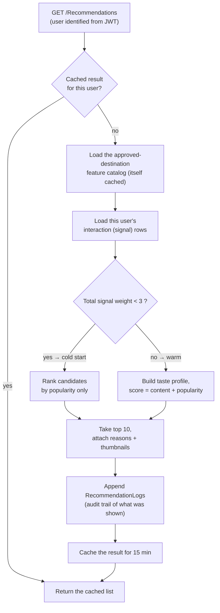

# Travle Recommender — A Plain-Language Explanation

> **What this file is.** A from-scratch, human-friendly walkthrough of how Travle recommends
> destinations. It assumes **no prior knowledge** of recommender systems or the math involved.
>
> **What this file is _not_.** It is not the graded deliverable. The formal specification lives in
> [`docs/context/04-recommender-spec.md`](context/04-recommender-spec.md) (terse, written for precision),
> and the submission document `recommender-dokumentacija.md` (Bosnian) is derived from that spec. This
> file is the "explain it to me like I'm learning it" companion — read this first, and the other two will
> make sense.

---

## Table of contents

1. [The one-paragraph summary](#1-the-one-paragraph-summary)
2. [What problem are we even solving?](#2-what-problem-are-we-even-solving)
3. [Two families of recommenders (and why we chose ours)](#3-two-families-of-recommenders-and-why-we-chose-ours)
4. [The big idea: turning "taste" into numbers](#4-the-big-idea-turning-taste-into-numbers)
5. [Signals — what we watch, and how much each counts](#5-signals--what-we-watch-and-how-much-each-counts)
6. [Step 1: building your taste profile](#6-step-1-building-your-taste-profile)
7. [Step 2: scoring every candidate destination](#7-step-2-scoring-every-candidate-destination)
8. [Cold start: what happens to brand-new users](#8-cold-start-what-happens-to-brand-new-users)
9. [Explanations: where the "because you…" text comes from](#9-explanations-where-the-because-you-text-comes-from)
10. [The second feature: "Similar destinations"](#10-the-second-feature-similar-destinations)
11. [A complete worked example (with real numbers)](#11-a-complete-worked-example-with-real-numbers)
12. [What our live system actually returned](#12-what-our-live-system-actually-returned)
13. [How it's built (architecture, files, data flow)](#13-how-its-built-architecture-files-data-flow)
14. [Design decisions and the "why" behind each](#14-design-decisions-and-the-why-behind-each)
15. [Glossary](#15-glossary)

---

## 1. The one-paragraph summary

Every time a traveler does something meaningful in the app — views a destination, searches, favorites,
books, leaves a good review — we quietly write down a small "signal". From all of a user's signals we
build a **taste profile**: a numeric fingerprint of what kinds of places they like (which *categories*,
which *tags*, which *regions*). When they open the app, we compare that fingerprint against every
destination they could still visit, score each one, and show the best matches **with a sentence
explaining why**. Brand-new users who have no signals yet simply get the most popular, highest-rated
places instead. That's the whole system. The rest of this document explains each piece slowly.

---

## 2. What problem are we even solving?

Travle has a catalog of tourist destinations. A traveler opening the home screen shouldn't have to scroll
through all of them hoping to stumble onto something they'd like. We want to **put the right destinations
in front of the right person automatically** — "Based on what you seem to enjoy, here are places you'll
probably love."

A good recommender needs three things, and the course grades us on all three:

1. **It must actually use the user's behavior.** Not random, not hand-picked — driven by what the user did.
2. **It must be explainable.** For every recommendation we must be able to say *why* ("because you're
   interested in Nature"). A black box that just spits out answers is not acceptable here.
3. **The signals it uses must be produced by the running app**, not faked. When you favorite something,
   the app really records that.

Keep these three requirements in mind — every design choice traces back to one of them.

---

## 3. Two families of recommenders (and why we chose ours)

There are two classic ways to build a recommender. It helps to know both, because our choice is a
reaction to their trade-offs.

### 3a. Collaborative filtering — "people like you also liked…"

This approach ignores *what* a destination is. It only looks at patterns across many users: "Users who
behaved like you also enjoyed X, so you'll probably enjoy X too." Netflix's classic engine works this way.

- **Strength:** it can find surprising matches (things you'd never guess from the item's description).
- **Weakness for us:** it needs *lots* of users and *lots* of overlapping activity to find those
  patterns, it can't easily explain itself ("you liked X because 4,000 strangers with similar taste did"
  is not a satisfying reason), and it struggles badly when a user or item is new (nothing to compare to).

### 3b. Content-based filtering — "more of what *you* like"

This approach looks at **the properties of the items themselves**. It learns *your* taste from *your* own
history, then finds items whose properties match that taste. "You keep engaging with historic Ottoman
sites in Herzegovina, so here's another historic Ottoman site in Herzegovina."

- **Strength:** it works from a single user's data (no crowd needed), and it explains itself naturally —
  the matching property *is* the reason.
- **Weakness:** it can be a bit "samey" (it recommends more of what you already like, rarely a wildcard).

### Our choice: content-based

We use **content-based filtering**, for reasons that map directly onto the three requirements from §2:

- It **explains itself** by construction (requirement 2) — the shared property is the reason.
- It works at **our data scale** (a seminar project has a handful of seed users, not millions).
- The approved project description explicitly promised *weighted signals* — "a completed booking is a
  stronger signal than a page view." Content-based filtering implements that idea literally, whereas the
  machine-learning library the course mentions (ML.NET) only ships a *collaborative* recommender, which
  has no natural place for weighted signals and no built-in explanations.

> **Important nuance:** "content-based" here does **not** mean a trained machine-learning model with a
> training phase and model files. Ours is a **deterministic scorer**: a fixed, documented formula plus a
> fixed, documented table of weights. That table *is* our "model". Nothing is trained; nothing drifts.
> This is a deliberate strength — the behavior is completely predictable and the documentation can match
> the code exactly.

---

## 4. The big idea: turning "taste" into numbers

Everything below rests on one mental model. Learn this and the rest is detail.

### 4a. Destinations are described by "features"

Every destination in Travle has a few descriptive properties we care about:

- exactly **one category** (e.g. *Natural Wonder*, *Old Town*, *Historical Site*),
- some **tags** (e.g. *Ottoman*, *Waterfall*, *UNESCO*),
- and it sits in exactly **one region** (e.g. *Herzegovina-Neretva*, *Bosanska Krajina*).

We call each possible property a **feature**. Think of the complete list of features as a long row of
checkboxes:

```
[ Category:Natural Wonder ] [ Category:Old Town ] [ Category:Historical Site ] ...
[ Tag:Ottoman ] [ Tag:Waterfall ] [ Tag:UNESCO ] ...
[ Region:Herzegovina-Neretva ] [ Region:Bosanska Krajina ] ...
```

A single destination "checks" a few of these boxes and leaves the rest empty. For example, **Stari Most**
(the Old Bridge in Mostar) checks: `Category:Old Town`, `Tag:Ottoman`, `Region:Herzegovina-Neretva`, and
nothing else. In math language, that list of 0/1 checkboxes is called a **vector** — but you can just
picture it as "the boxes this destination ticks."

### 4b. Your taste is the same row of boxes, but with dials instead of checkboxes

Your **taste profile** uses the exact same list of features — except instead of a checkbox (yes/no), each
feature has a **dial** turned up according to how much you've shown interest in it. If you keep engaging
with waterfalls, the `Tag:Waterfall` dial is turned way up. If you've never touched anything historical,
the `Category:Historical Site` dial sits at zero.

So the whole recommender boils down to: **turn the user's dials up based on their behavior, then find the
destinations whose ticked boxes line up best with the turned-up dials.** That "lining up" is measured with
a formula called *cosine similarity*, which we'll build up to gently.

---

## 5. Signals — what we watch, and how much each counts

A **signal** (we store them in a table called `UserInteractions`) is one recorded action that tells us
something about a user's taste. Not all actions mean the same thing: actually *completing a booking* says
far more about your taste than *glancing at a page*. So each signal type carries a **weight** — a number
representing how strong that evidence is.

| What the user did | Signal type | Weight | Why this weight |
|---|---|---:|---|
| Finished a booked tour | `BookingCompleted` | 5 | Strongest possible evidence — they actually went. |
| Paid & confirmed a booking | `BookingConfirmed` | 4 | Committed money, but hasn't travelled yet. |
| Added to favorites | `Favorite` | 3 | A deliberate "I want to remember this." |
| Left a 4–5★ review | `ReviewHigh` | 3 | Went somewhere and rated it highly. |
| Picked an interest at signup | `OnboardingInterest` | 2 | Stated preference, but it's a claim, not a behavior. |
| Opened a destination's details | `View` | 1 | Mild curiosity; cheap and noisy. |
| Searched for a category/tag | `Search` | 1 | Mild intent; also cheap and noisy. |

Two things to understand about the weights:

- **The order matters more than the exact numbers.** As you'll see in §6c, we mathematically "normalize"
  the profile, which means only the *ratios* between weights survive — a booking counting **5×** a view is
  what matters, not the literal "5" and "1". (We could have used 50 and 10 and gotten identical results.)
- **Where the signal comes from.** Most signals are tied to a *destination* (you viewed/favorited/booked a
  specific place), so we expand them into that destination's category+tags+region. Two signals —
  onboarding picks and searches — are tied directly to a *category or tag* (you searched "waterfall"),
  with no specific destination.

> **The app writes these, never the client.** The Flutter app never posts a signal directly. The server
> records them inside the endpoints that already handle those actions (the details endpoint records a
> `View`, the favorites service records a `Favorite`, the booking state machine records
> `BookingConfirmed`/`BookingCompleted`, and so on). This is requirement 3 from §2.

> **Searching with several categories selected.** The category filter on the search screen is a
> multi-select, and every category the traveler picked is a stated interest — so the search endpoint
> records **one full-weight `Search` row per selected category**, exactly as onboarding records one row
> per pick. Because the profile is normalized (§6c), picking five categories doesn't make that user's
> profile "louder"; it just spreads the same search evenly across five dials. With no category selected,
> the search text itself is matched against category names and then tag names; if it matches neither, the
> row is still written (so the search history is real) but names no feature, so it moves no dial. Only
> searches that carry text are recorded — the screen runs a search on open, and recording those would
> log intent nobody expressed.

---

## 6. Step 1: building your taste profile

Now we combine all of a user's signals into one taste profile (the "row of dials"). Three sub-steps.

### 6a. Add up the weights per feature

Go through every one of the user's signals. For each one, add its weight onto the relevant dials:

- A **destination-linked** signal (view/favorite/booking/review) adds its weight to *that destination's*
  category dial, region dial, and each of its tag dials.
- An **onboarding or search** signal adds its weight directly to the category or tag dial it names, with
  no destination involved. (A search filtered to several categories writes one such signal each.)

If several signals touch the same feature, the weights **stack up** — that's the point. Favoriting *and*
reviewing *and* booking waterfalls all pile onto the `Tag:Waterfall` dial, making it dominant.

### 6b. The recency boost — recent interest counts more

Tastes drift. Something you engaged with last week is better evidence of your *current* mood than
something from a year ago. So any signal from **the last 30 days** gets its weight multiplied by **1.5**
before being added. A favorite from last week contributes `3 × 1.5 = 4.5`; the same favorite from two
months ago contributes just `3`. This is our gentle "forgetting" mechanism — old interest fades in
relative importance without us ever deleting anything.

### 6c. Normalize — put everyone on the same scale

Here's a subtle but important step. A hyper-active user might rack up huge dial values (hundreds of
points); a casual user has tiny values. If we compared them raw, the active user's numbers would dwarf
everything. We don't actually care about *how much* someone has interacted — we care about the **shape**
of their taste: the *proportion* of waterfalls-to-fortresses-to-old-towns.

**Normalizing** rescales the whole profile so its overall "length" becomes exactly 1, while keeping all
the proportions intact. Concretely: we take the square root of the sum of all the squared dial values
(that's the profile's "length"), and divide every dial by it.

This has two happy consequences:
- Two users with the same *taste shape* but different *activity levels* end up with the same profile.
- It's why the absolute weight numbers don't matter — only their ratios (§5) survive normalization.

### 6d. Mini-example

Let's use a tiny world with just **four features**: `Cat:Nature`, `Cat:History`, `Tag:Waterfall`,
`Region:Krajina`. Suppose a user has three signals (all older than 30 days, so no recency boost):

| Signal | Weight | Dials it turns up |
|---|---:|---|
| Onboarding pick: Nature | 2 | `Cat:Nature +2` |
| Favorited a nature waterfall in Krajina | 3 | `Cat:Nature +3`, `Tag:Waterfall +3`, `Region:Krajina +3` |
| Viewed a historical site in Krajina | 1 | `Cat:History +1`, `Region:Krajina +1` |

**Raw dials:** `Cat:Nature = 5`, `Cat:History = 1`, `Tag:Waterfall = 3`, `Region:Krajina = 4`.

**Length** = √(5² + 1² + 3² + 4²) = √(25+1+9+16) = √51 ≈ **7.14**.

**Normalized profile** (each dial ÷ 7.14):

| Feature | Normalized value |
|---|---:|
| `Cat:Nature` | 0.700 |
| `Region:Krajina` | 0.560 |
| `Tag:Waterfall` | 0.420 |
| `Cat:History` | 0.140 |

This is the user's taste fingerprint: strongly Nature, strongly Krajina, moderately waterfalls, barely
historical. We'll score destinations against it in the next section.

---

## 7. Step 2: scoring every candidate destination

With the profile ready, we score the destinations. Each candidate gets a **final score** that blends two
things: how well it matches the user's *taste* (content), and how *popular* it is.

### 7a. Which destinations are candidates?

Every **approved** destination, **except** ones the user has already *completed a booking* for (no point
recommending a trip they already took). Note we deliberately **do not** exclude places they merely
favorited — a saved-and-forgotten destination *should* be allowed to resurface.

### 7b. The content score = cosine similarity (this is the key formula)

We need to measure how well a candidate's ticked boxes line up with the user's turned-up dials. The tool
for that is **cosine similarity**.

**The intuition:** imagine the profile and the destination each as an arrow pointing somewhere in the
"space of features". Cosine similarity measures the **angle** between the two arrows:

- pointing the **same direction** → cosine = **1.0** (perfect taste match),
- **perpendicular** (nothing in common) → cosine = **0.0**,
- it never goes negative here, because dials and checkboxes are never negative.

Crucially, cosine looks only at *direction*, not *length* — so a destination with tons of tags doesn't
automatically win just for being "bigger". It has to point the *right way*.

**The computation** (simpler than it sounds, because the profile is already normalized to length 1 and a
destination's boxes are just 0/1):

```
contentScore = (sum of the profile's dials for the boxes this destination ticks)
               ÷ √(number of boxes this destination ticks)
```

**Continuing the mini-example.** Take candidate **D** = a *nature waterfall in Krajina*, so it ticks
`Cat:Nature`, `Tag:Waterfall`, `Region:Krajina` (3 boxes):

```
top part  = 0.700 (Nature) + 0.420 (Waterfall) + 0.560 (Krajina) = 1.680
bottom    = √3 = 1.732
contentScore(D) = 1.680 ÷ 1.732 = 0.970   ← almost a perfect taste match
```

Now candidate **E** = a *historical site in Krajina*, ticking `Cat:History`, `Region:Krajina` (2 boxes):

```
top part  = 0.140 (History) + 0.560 (Krajina) = 0.700
bottom    = √2 = 1.414
contentScore(E) = 0.700 ÷ 1.414 = 0.495   ← a weaker match (only the region really lines up)
```

So on taste alone, **D (0.970) beats E (0.495)** — exactly what we'd expect, since the user loves nature
and waterfalls while barely caring about history.

### 7c. The popularity score

Pure taste-matching can be a little insular, so we mix in a small dose of "this place is objectively
well-liked." The popularity score combines the destination's average rating and how much it's been viewed:

```
popularityScore = 0.7 × (averageRating ÷ 5)
                + 0.3 × ( log(1 + viewCount) ÷ log(1 + biggestViewCountInCatalog) )
```

- The **rating** part dominates (weight 0.7): a 4.5★ place scores `4.5/5 = 0.9` on that part.
- The **views** part (weight 0.3) uses a **logarithm** so that going from 10 → 100 views matters, but 
  10,000 → 100,000 doesn't keep mattering linearly (popularity has diminishing returns). We divide by the
  most-viewed destination so the result always lands between 0 and 1. (If nothing has any views yet, this
  part is just 0 — no division-by-zero.)

### 7d. The final blend

```
finalScore = 0.8 × contentScore + 0.2 × popularityScore
```

Taste is weighted **4× more** than popularity (0.8 vs 0.2) — this is a *personalized* recommender first,
a "what's trending" list second. We then sort candidates by `finalScore`, highest first, and take the
**top 10**.

### 7e. The minimum threshold — no unexplainable recommendations

One rule sits on top: a candidate only qualifies if its **content score is above zero** — i.e. it shares
**at least one feature** with the user's taste. Why? Because if a place has *nothing* in common with you,
we can't honestly write a "because you like…" sentence for it (requirement 2 from §2). Rather than pad the
list with unexplainable filler, we'd rather show fewer, honest recommendations. (Places with zero overlap
aren't lost — they still appear in the separate "Popular" section on the home screen.)

This is visible in the real data: our test user had 10 candidates but got **7** recommendations — the 3
with no shared feature were correctly dropped.

---

## 8. Cold start: what happens to brand-new users

A brand-new user has few or no signals, so there's no taste profile to speak of. This is the classic
**"cold-start problem."** Our rule:

> If the user's **total signal weight is below 3**, skip the personalized scoring entirely and just rank
> destinations by **popularity** (§7c). The response is flagged `isColdStart: true` so the app can label
> the section honestly ("Popular right now — highly rated by other travelers").

Why 3? It ties into the weights. A single onboarding pick is worth 2 (still cold-start); *two* picks make
4 (warm enough for personalization); a single favorite or review or booking (weight 3+) also crosses the
line. In other words, **the moment we have any real evidence of taste, we switch to personalization** —
and until then, popular-and-highly-rated is a safe, sensible default. (This "total weight" check uses the
plain weights, without the recency boost — it's a question of *how much evidence exists*, not *how recent*.)

---

## 9. Explanations: where the "because you…" text comes from

Every recommendation ships with a human sentence. We generate it from the **single feature that
contributed most** to that destination's content score — i.e. the destination's highest turned-up dial.

- If that top feature is a **category** → *"Because you're interested in Natural Wonder"*
- If it's a **tag** → *"Shares a tag you like: Ottoman"*
- If it's a **region** → *"In Herzegovina-Neretva, a region you explore"*
- For **cold-start / popularity** items → *"Popular right now — highly rated by other travelers"*

In the mini-example, candidate **D**'s biggest matching dial was `Cat:Nature` (0.700), so its reason would
be *"Because you're interested in Nature."* Candidate **E**'s biggest was `Region:Krajina` (0.560), so
*"In Krajina, a region you explore."* The reason is never guesswork — it's literally the math's top term.

---

## 10. The second feature: "Similar destinations"

On a destination's detail page we also show a small **"Similar destinations"** strip. This is a *different*
question from the personalized list:

- The home recommendations answer *"what suits **you**?"* (uses your profile).
- "Similar destinations" answers *"what's like **this place**?"* (ignores your profile entirely).

Because it doesn't need a profile, **it works even for a brand-new user** who has no taste yet. We take the
destination you're looking at, and compare *its* boxes against every other destination's boxes with the
same cosine-similarity idea (this time between two destinations, not profile-vs-destination). We show the
top 5. The reason is built from the shared boxes:

- shared category **and** region → *"Also a medieval fortress in Bosanska Krajina"*-style
  (in our data: *"Also in Herzegovina-Neretva"*),
- shared tag → *"Shares the Ottoman theme"*.

---

## 11. A complete worked example (with real numbers)

Let's assemble the whole pipeline for the mini-example user, adding popularity so we get final scores.
Say the catalog's most-viewed destination has 100 views, and:

- **D** (nature waterfall, Krajina): average rating **4.5**, **80** views.
- **E** (historical site, Krajina): average rating **4.0**, **20** views.

**Content scores** (from §7b): D = 0.970, E = 0.495.

**Popularity scores** (from §7c):

```
D:  0.7 × (4.5/5)  + 0.3 × (log(81)/log(101))  = 0.7 × 0.900 + 0.3 × 0.952 = 0.630 + 0.286 = 0.916
E:  0.7 × (4.0/5)  + 0.3 × (log(21)/log(101))  = 0.7 × 0.800 + 0.3 × 0.660 = 0.560 + 0.198 = 0.758
```

**Final blend** (from §7d):

```
D:  0.8 × 0.970 + 0.2 × 0.916 = 0.776 + 0.183 = 0.959
E:  0.8 × 0.495 + 0.2 × 0.758 = 0.396 + 0.152 = 0.548
```

**Result:** D is recommended above E (0.959 vs 0.548), with the reason *"Because you're interested in
Nature."* Every number here came straight out of the user's own recorded behavior — that's the whole
promise of the system, start to finish.

---

## 12. What our live system actually returned

We ran the real backend against the seeded database on 2026-07-29. Two users, to show both paths.

**The `mobile` traveler (rich history → personalized):** `isColdStart: false`, 7 explained results:

| # | Destination | Score | Reason |
|---|---|---:|---|
| 1 | Baščaršija | 0.351 | Shares a tag you like: Ottoman |
| 2 | Jajce Waterfall | 0.306 | Shares a tag you like: Waterfall |
| 3 | Una National Park | 0.296 | Because you're interested in Natural Wonder |
| 4 | Bihać Old Town | 0.259 | Shares a tag you like: Ottoman |
| 5 | Vrelo Bosne | 0.242 | Because you're interested in Natural Wonder |
| 6 | Ostrožac Castle | 0.127 | Because you're interested in Historical Site |
| 7 | Srebrenik Fortress | 0.124 | Because you're interested in Historical Site |

**The `organizer` (no signals → cold start):** `isColdStart: true`, 10 results, every one labeled
*"Popular right now — highly rated by other travelers"* (Kravice Waterfalls 0.98, Blagaj Tekija 0.97,
Stari Most 0.93, …).

> **Why are the real scores (~0.3) so much lower than the mini-example's 0.959?** Because a *real* profile
> is spread across many features (7 categories, lots of tags, several regions), so no single destination
> lines up with *all* of it — the arrows never point in nearly the same direction. Lower absolute numbers
> are completely normal and expected; what matters is the **ranking**, and the ranking is sensible.

---

## 13. How it's built (architecture, files, data flow)

### 13a. Data flow for `GET /Recommendations`



### 13b. The pieces, and the files they live in

| Piece | What it does | File |
|---|---|---|
| **The "model"** (weights + formula constants) | The single source of truth for every tunable number | [`Recommender/RecommenderOptions.cs`](../Backend/Travle.Services/Recommender/RecommenderOptions.cs) |
| **The scorer** (pure math) | Builds profiles, computes cosine + popularity, ranks, finds the top reason | [`Recommender/RecommendationScorer.cs`](../Backend/Travle.Services/Recommender/RecommendationScorer.cs) |
| **The service** (orchestration) | Loads data, calls the scorer, builds cards, logs, caches | [`RecommendationService.cs`](../Backend/Travle.Services/RecommendationService.cs) |
| **The cache** | Per-user results + the shared catalog, in memory | [`Recommender/RecommendationCache.cs`](../Backend/Travle.Services/Recommender/RecommendationCache.cs) |
| **The endpoints** | `GET /Recommendations` and `GET /Destinations/{id}/similar` | [`Controllers/RecommendationsController.cs`](../Backend/Travle.WebAPI/Controllers/RecommendationsController.cs), [`DestinationsController.cs`](../Backend/Travle.WebAPI/Controllers/DestinationsController.cs) |
| **The signals table** | Where every recorded interaction lives | `UserInteraction` entity |
| **The audit log** | A record of every recommendation ever *shown* | `RecommendationLog` entity |

### 13c. Two things we store, one thing we compute

- **Stored as input:** `UserInteractions` (the signals). This is the *only* thing the recommender reads.
- **Computed fresh each time:** the profile, the scores, the ranking. We do **not** keep a precomputed
  recommendations table or a precomputed profile table (see §14 for why). We compute on demand.
- **Stored as output:** `RecommendationLogs` — every recommendation we actually served, with its score and
  reason. This is never fed back into scoring; it's a pure audit trail that lets us *prove after the fact*
  that every recommendation was explainable.

### 13d. Caching (so we don't recompute constantly)

Computing is cheap, but identical repeated requests shouldn't hit the database every time. Two caches:

- **Per-user result cache** — a user's computed list is remembered for **15 minutes**. It is thrown away
  early ("invalidated") the moment the user does something that changes their taste: a favorite, a review,
  an onboarding submission, or a booking confirm/complete. (A plain page *view* does **not** invalidate —
  it's too weak and too frequent to justify recomputing; the 15-minute expiry covers it eventually.)
- **Catalog cache** — the list of approved destinations and their features is "hot" data that rarely
  changes, so we cache it briefly and share it across all users.

---

## 14. Design decisions and the "why" behind each

These are the choices most likely to come up in a defense. Each is a deliberate trade-off.

**Why content-based instead of a trained ML model?**
It explains itself, works at our data scale, and implements the promised "weighted signals" literally. A
trained model would need training data we don't have, would need retraining, and couldn't explain itself
without a *second* content-overlap computation bolted on anyway. Our "model" is the documented weight
table + formula, versioned with the code — so the documentation can match the implementation exactly,
which the course explicitly checks.

**Why compute on demand instead of precomputing recommendations?**
At our scale, building a profile and scoring takes milliseconds. Computing on demand guarantees a
**single source of truth**: recommendations always reflect the *current* signals, and the code trivially
matches the docs. A precomputed table would introduce staleness and a refresh job for no real benefit. A
precomputed *profile* table would duplicate information that already lives in the signals — any missed
update would silently corrupt results, and time-decay (the recency boost) would be awkward to maintain.
The only downside of on-demand — repeated identical requests — is handled by the 15-minute cache.

**Why is the signals table "append-only" — except for one case?**
Signals are a historical log: "you viewed X on this date" is a fact that stays true forever, and the
recency boost naturally fades old facts without deleting them. This keeps the log a clean single source of
truth. **The one exception is `ReviewHigh`:** a 4–5★ review can later be edited down to 2★ or removed
entirely, at which point its defining condition ("rated 4–5") is no longer true — so we drop that one
signal to keep it honest. It's handled in exactly one place (the review service), so there's no risk of it
getting out of sync.

**Why does un-favoriting *not* remove the signal?**
A recommender models your *taste* (categories/tags/regions), not a wishlist. The fact that you once
favorited a historic Ottoman bridge is still weak evidence about your taste, even after you remove that
specific bookmark — and the recency boost fades it over time anyway. Keeping it append-only is simpler and
avoids the "silent corruption" risk of extra delete paths.

**Why the "at least one shared feature" threshold?**
Because the course requires every recommendation to be explainable, and a place with zero overlap has no
honest reason. We'd rather show 7 explainable results than 10 with 3 unexplainable ones.

**Why are the weights round integers, and can they change?**
They're round because they're a *documented, defensible ranking* of signal strength, not learned values —
and because normalization means only their ratios matter, so 5/4/3/3/2/1/1 and 50/40/30/30/20/10/10 behave
identically. They *can* change, but the spec, this explanation, the Bosnian document, and the code must
all move together in the same commit — so we freeze them unless there's a real reason.

---

## 15. Glossary

- **Signal / interaction** — one recorded user action (view, search, favorite, review, booking, onboarding
  pick), stored in `UserInteractions` with a weight.
- **Weight** — a number saying how strong a signal is as evidence of taste (booking 5 … view 1).
- **Feature** — one describable property a destination can have: a specific category, tag, or region.
- **Feature space / vector** — the full list of possible features; a destination or a profile is a set of
  numbers over that list (mostly zeros — "sparse").
- **Taste profile** — the user's per-feature "dials", built by summing weighted signals.
- **Normalization** — rescaling the profile so its overall length is 1, keeping only the *proportions* of
  taste (so activity level doesn't matter, only shape).
- **Recency boost** — the ×1.5 multiplier applied to signals from the last 30 days.
- **Cosine similarity** — a 0-to-1 measure of how well two vectors point the *same direction*; our
  "content score". 1 = perfect alignment, 0 = nothing in common.
- **Content score** — how well a destination matches the user's taste (the cosine value).
- **Popularity score** — how well-rated and well-viewed a destination is, independent of the user.
- **Final score** — `0.8 × content + 0.2 × popularity`; what we sort by.
- **Cold start** — the situation where a user has too little signal (< 3 total weight) to personalize, so
  we fall back to popularity.
- **Candidate** — an approved destination the user hasn't already completed, eligible to be recommended.
- **RecommendationLog** — an output record of a recommendation actually shown (audit trail, never reused as
  input).
- **Cache invalidation** — throwing away a user's cached recommendations early because they did something
  that changed their taste.
