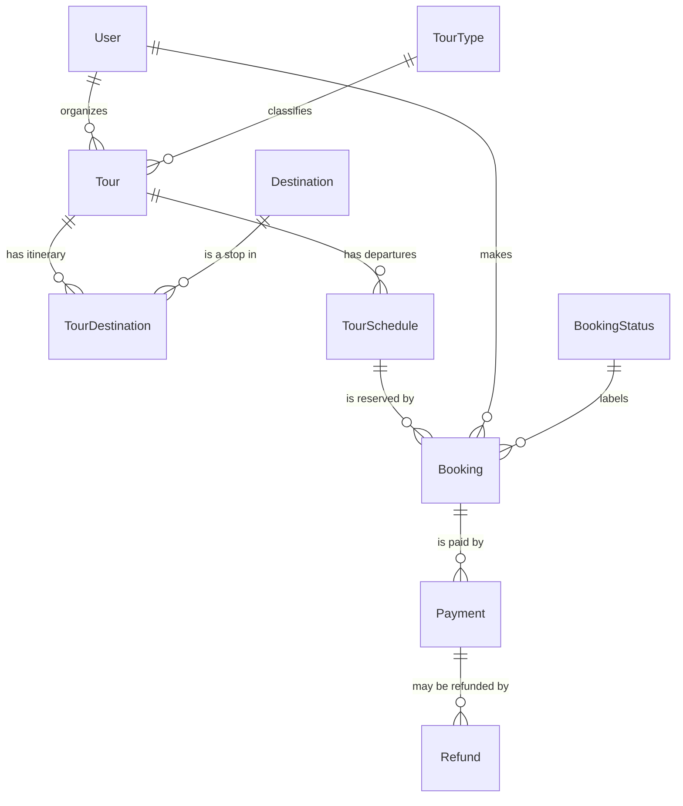
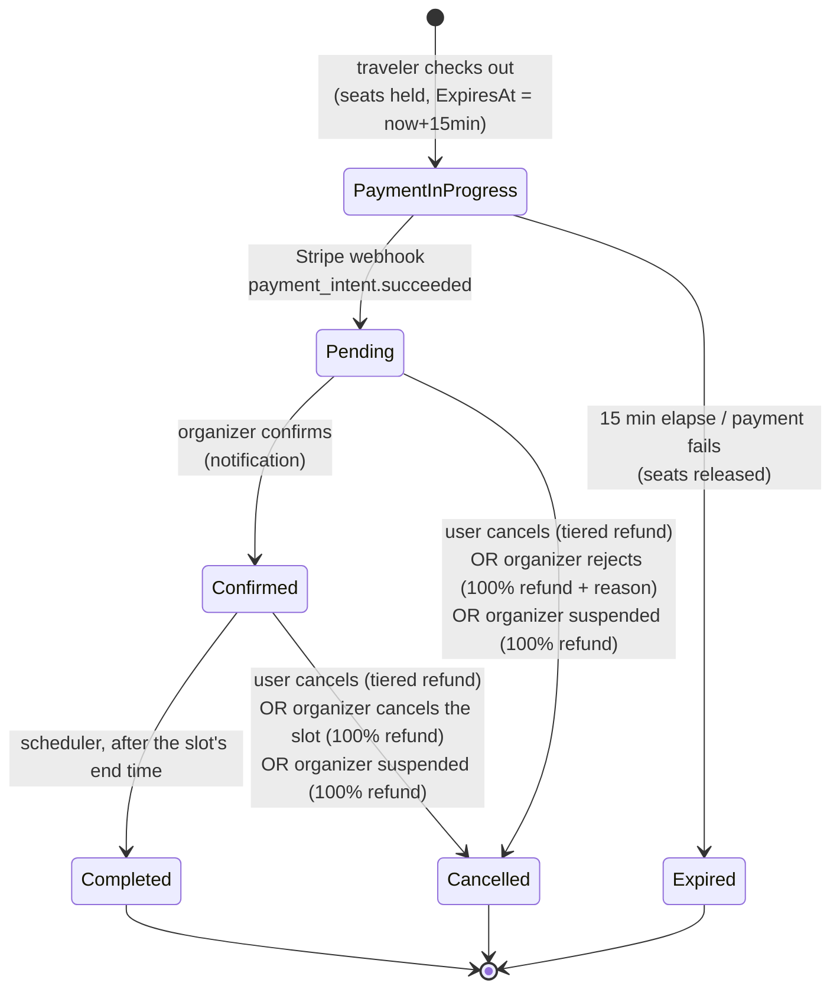

# Tours, Schedules & Bookings — How It All Fits Together

> A plain-English walkthrough of the four entities at the heart of Travle's marketplace:
> **Tour → TourDestination → TourSchedule → Booking** (plus the payment/refund tail that
> comes later). Written to be read top-to-bottom; every field name matches the real code in
> `Travle.Services/Database`. Examples use the actual seed data so you can cross-check against
> a running database.

---

## 1. The one-paragraph mental model

Think of a cinema:

| Cinema thing | Travle thing | What it is |
|---|---|---|
| A **film** ("Dune") | **Tour** | The *offering* — a named, priced experience an organizer sells. Reusable. |
| The film's **scenes/locations** | **TourDestination** | The *itinerary* — which places the tour visits, **in order**. |
| A **specific screening** (Sat 20:00, Screen 3, 60 seats) | **TourSchedule** | One concrete **departure**: a date/time slot of a tour, with its own seat count. |
| Your **ticket(s)** for that screening | **Booking** | A traveler reserving *N seats on one specific departure*. |

So a **Tour** is a *template/definition*, a **TourSchedule** is a *dated instance* of that template that people can actually book, and a **Booking** is one traveler's claim on seats of one schedule. **TourDestination** is just the glue that says "this tour visits these places, in this order."

Nobody books a *Tour* directly — they book a *Schedule* of a tour. That distinction is the key insight.

---

## 2. Each entity in detail

### 2.1 `Tour` — the offering (the "what")

The reusable definition of an experience, owned by one organizer.

```
Tour
├─ OrganizerId    → User   (the organizer who sells it; from JWT, never the client)
├─ Name, Description
├─ DurationMinutes         (how long one run lasts, e.g. 120 = 2h)
├─ PricePerPerson          (decimal, in KM — the price is server-owned)
├─ Capacity                (DEFAULT group size, copied into new schedules)
├─ TourTypeId     → TourType  (Walking / Cultural / Adventure / … — a dropdown FK)
└─ IsActive                (the soft on/off switch)
```

- **Who creates it:** an **Organizer** (desktop). The `OrganizerId` is taken from the JWT — a client can never set it.
- **Price & duration live here, not on the schedule.** Every departure of "Mostar Old Town Walking Tour" costs 25 KM/person and lasts 120 minutes.
- **`Capacity` here is only a *default*.** It is *copied* into each new schedule as a starting value; the schedule's own capacity is what actually limits bookings (see §5). This is a deliberate decision so a one-off "smaller van that day" is expressible per departure.
- **"Deleting" a tour = deactivating it** (`IsActive = false`). It disappears from traveler browsing and can't take new bookings, but its history (past schedules, bookings, reviews) stays intact. A *hard* delete is allowed **only if the tour was never scheduled** (fixing a mistake right after creation). Deactivation **honours** existing upcoming bookings — the desktop confirm dialog says so; to actually call one off, the organizer cancels that schedule (100% refund).
- **A tour with an under-review stop is hidden from travelers entirely** (added 2026-08-18). Every stop must be an *approved* destination at create/update time (`EnsureApprovedDestinationsAsync`), but a stop can later be pulled back into moderation (its curator edits it) or rejected. The moment any stop is non-approved, `TourResponse.HasUnavailableDestination` flips true and the tour is dropped from **all** traveler surfaces — public browse, the "tours visiting here" list on a destination, favorites, and the detail read (`SearchAsync` forces `ExcludeUnavailableDestinations`; `GetDetailAsync` blocks non-owners; `FavoriteService` filters it). Without this a traveler could reach the tour via one of its *approved* stops and open the under-review one from the itinerary. The organizer still sees the tour on **My Tours**, badged **"Temporarily unavailable"**, so they know it's out and reappears automatically once the stop is approved again. (This pairs with the `DestinationUnavailable`/`DestinationAvailable` organizer notifications — see `notifications-and-signalr.md` §7.)
- **A non-approved destination's detail is private** to its submitter and admins (`DestinationService.GetDetailAsync` gates on status). Approved destinations are public to any authenticated user; a pending/rejected one is never readable by id — not through a tour, not by guessing — so the moderation catalogue stays private.

### 2.2 `TourDestination` — the itinerary (the "where", ordered)

A **link row** joining a tour to a destination it visits, carrying the visiting order.

```
TourDestination
├─ TourId         → Tour
├─ DestinationId  → Destination   (must be an APPROVED destination)
└─ SortOrder                      (1, 2, 3 … the itinerary order)
```

- This is a **many-to-many** relationship made explicit: one tour visits many destinations, and one destination can appear in many tours. Because the link carries a *meaningful attribute* (`SortOrder`), it's a real entity (inherits `BaseEntity`), not a bare join table.
- **Ordered.** "Mostar Old Town Walking Tour" visits **Stari Most (1) → Blagaj Tekija (2)**. The order is the route the guide follows.
- **Only approved destinations** may be added (enforced server-side). Destinations are content that curators/organizers submit and admins moderate — a tour can't advertise an unapproved or rejected place.
- Managed *through the tour's edit form*: reordering or removing a stop adds/deletes/updates these link rows; it never touches the `Destination` itself.

### 2.3 `TourSchedule` — a departure/slot (the "when" + seats)

A concrete, bookable instance of a tour on a specific date/time.

```
TourSchedule
├─ TourId       → Tour
├─ StartsAt                (UTC; the organizer picks this)
├─ EndsAt                  (UTC; DERIVED = StartsAt + Tour.DurationMinutes)
├─ Capacity                (seats for THIS departure; defaults from Tour.Capacity)
├─ SeatsTaken              (how many seats are currently held/booked — maintained transactionally)
├─ Status                  (Active / Cancelled)
├─ CancelledReason?, CancelledAt?
```

- **This is what travelers actually book.** A tour with no schedules is just a catalog entry nobody can reserve.
- **`EndsAt` is derived, not entered.** The organizer only picks `StartsAt`; the server computes `EndsAt = StartsAt + Tour.DurationMinutes`. A slot can therefore never contradict the tour's stated duration.
- **`SeatsTaken` is the live occupancy.** It starts at 0 and is bumped up/down *transactionally* as bookings are made, expire, or cancel (§5, §6). **Free seats = `Capacity − SeatsTaken`.**
- **Cancelling a slot is a status change, not a delete** (`Status = Cancelled` + reason + timestamp). From Phase 6, cancelling a slot that has bookings automatically refunds every booking on it 100% and notifies those travelers. A *hard* delete is allowed only for a **future slot with zero bookings** (fixing a typo departure).

### 2.4 `Booking` — a reservation (the "who booked what")

One traveler's reservation of seats on one schedule.

```
Booking
├─ UserId          → User          (the traveler; from JWT)
├─ TourScheduleId  → TourSchedule  (which departure)
├─ NumberOfPeople                  (how many seats)
├─ TotalAmount                     (= PricePerPerson × NumberOfPeople, computed SERVER-SIDE)
├─ StatusId        → BookingStatus (the lifecycle state — see §6)
├─ StatusChangedAt
├─ ConfirmedByUserId?, RejectionReason?           (organizer decision audit)
├─ CancelledByUserId?, CancellationReason?        (cancellation audit)
└─ ExpiresAt?                      (set +15 min while PaymentInProgress; the seat "hold")
```

- A booking points at a **schedule**, not a tour. To know *which tour* a booking is for, you follow `Booking → TourSchedule → Tour`.
- **`TotalAmount` is never trusted from the client.** The server multiplies the tour's `PricePerPerson` by `NumberOfPeople` at creation time and snapshots the result, so later price edits don't change existing bookings.
- **The status is the whole story of the booking** and is only ever changed by the centralized state machine (§6). Bookings are **never hard-deleted** — even `Expired` and `Cancelled` rows are kept as audit evidence.
- **`ExpiresAt`** is the reservation's 15-minute grace period: while a booking is `PaymentInProgress`, it holds its seats until this instant; if payment doesn't complete, a scheduler expires it and releases the seats.

### 2.5 The supporting cast (brief — full detail in later phases)

- **`TourType`** — a reference dropdown (Walking / Cultural / Adventure / Food / Private). A tour has exactly one.
- **`BookingStatus`** — the reference table of the six lifecycle states. Seeded with **load-bearing Ids** (see §6) — the code matches on these.
- **`Payment`** *(Phase 6)* — one Stripe charge for a booking. Snapshots the amount + the 10% platform fee. A booking becomes paid only when Stripe's webhook confirms it.
- **`Refund`** *(Phase 6)* — money returned for a cancelled/rejected booking, computed from the **actually charged amount** and the applicable refund tier.
- **`RefundPolicyTier`** — the global refund ladder (>72h = 100%, 24–72h = 50%, 1–24h = 25%, <1h = 0%).
- **`TourReview`** *(Phase 7)* — a review of a tour, gated to a traveler's own *Completed* booking.

---

## 3. How they relate (the map)



Reading the cardinalities:

- **One Tour → many TourDestinations → many Destinations** (ordered many-to-many via the link).
- **One Tour → many TourSchedules** (its departures over time).
- **One TourSchedule → many Bookings** (several travelers on the same departure).
- **One Booking → one TourSchedule → one Tour** (walk *up* the chain to find the tour).
- **One Booking → one/more Payments → possibly Refunds** (the money tail, Phase 6).

The chain that matters most in practice:

```
Booking ──▶ TourSchedule ──▶ Tour ──▶ TourDestination[] ──▶ Destination[]
 (seats)      (date+seats)    (price)    (order)              (the places)
```

---

## 4. A worked example (straight from the seed data)

**Tour 1 — "Mostar Old Town Walking Tour"** (organizer *Omar Organizer*, `TourTypeId` 1 = Walking):
`DurationMinutes = 120`, `PricePerPerson = 25.00 KM`, `Capacity = 15`.

Its **itinerary** (`TourDestination`):

| SortOrder | Destination |
|---|---|
| 1 | Stari Most (Mostar) |
| 2 | Blagaj Tekija (Blagaj) |

Its **departures** (`TourSchedule`) — note `EndsAt` = start + 120 min:

| Schedule | StartsAt (UTC) | EndsAt | Capacity | SeatsTaken | Status | Bookable now? |
|---|---|---|---|---|---|---|
| #1 | 2026-06-20 10:00 | 12:00 | 15 | 2 | Active | ❌ in the past |
| #2 | 2026-08-15 10:00 | 12:00 | 15 | 0 | Active | ✅ 15 free |
| #3 | 2026-09-10 10:00 | 12:00 | 15 | 0 | Active | ✅ 15 free |

A **booking** on this tour (`Booking #1`):

- Traveler *mobile* (User 4) booked **Schedule #1**, `NumberOfPeople = 2`.
- `TotalAmount = 25.00 × 2 = 50.00 KM` (computed server-side — matches the seed).
- Status `Completed` (Id 4): the departure happened, the scheduler auto-completed it.
- It has a succeeded **Payment** of 50.00 KM (fee 5.00 KM), and the traveler left a **TourReview** — because reviews are gated to a *Completed* booking.

Compare the other seeded bookings — one row in each demonstrable state:

| Booking | Traveler | Schedule → Tour | People | Total | Status | Story |
|---|---|---|---|---|---|---|
| #1 | User 4 | #1 → Mostar Walk | 2 | 50.00 | **Completed** | Paid, happened, reviewed |
| #2 | User 4 | #6 → Sarajevo Cultural | 1 | 30.00 | **Confirmed** | Paid, organizer confirmed, upcoming |
| #3 | User 5 | #9 → Blagaj & Počitelj | 3 | 120.00 | **Cancelled** | Paid, then user cancelled >72h out → 100% refund |
| #4 | User 4 | #4 → Kravice Day Trip | 2 | 90.00 | **Pending** | Paid, waiting for the organizer to confirm |

That single table *is* the booking lifecycle, frozen at four different moments.

---

## 5. The capacity & seats model (the part that trips everyone up)

There are **two** `Capacity` fields and it's worth being crystal clear:

| Field | Lives on | Role |
|---|---|---|
| `Tour.Capacity` | the tour | **Default only.** Copied into each new schedule as a starting value. Editing it does *not* change existing schedules. |
| `TourSchedule.Capacity` | the departure | **Authoritative.** This is the real seat limit the booking guard checks. |
| `TourSchedule.SeatsTaken` | the departure | Live count of seats currently held or booked. Maintained transactionally. |
| *FreeSeats* (computed, not stored) | — | `Capacity − SeatsTaken`. What the mobile app shows travelers. |

So when a traveler is about to book Schedule #2 (Capacity 15, SeatsTaken 0), they see **15 free seats**. If they book 4, `SeatsTaken` becomes 4 and the next traveler sees **11 free**.

**Why two capacities?** Because a tour's usual group size (15) and a *particular* departure's capacity (maybe only 8 that day because of a smaller boat) can differ. The tour value seeds the form; the organizer can override per departure.

---

## 6. The booking lifecycle & state machine (Phase 5) — *yes, this is coming next*

**Your question: "Will we have a state machine for the bookings in the next phase?"**
**Answer: yes — building it *is* the core of Phase 5.** Right now (end of Phase 4) tours and schedules exist and are browsable, but **no booking can be created yet**. Phase 5 introduces the `BookingStateMachine`: a single, centralized service (the *State* design pattern, dependency-injected) that owns **every** legal transition. No controller and no other service is allowed to change a booking's status directly — this is a hard course rule (status changes must go through one place, never scattered).

### The states (`BookingStatus`, seeded with fixed Ids)

| Id | State | Meaning |
|---|---|---|
| 1 | **PaymentInProgress** | Seats held; the traveler is at the payment step. Has a 15-min `ExpiresAt`. |
| 2 | **Pending** | Payment succeeded; waiting for the organizer to confirm. |
| 3 | **Confirmed** | Organizer accepted. The booking is locked in. |
| 4 | **Completed** | The departure's end time passed; auto-completed by the scheduler. |
| 5 | **Cancelled** | Called off (by the traveler, or organizer reject/slot-cancel). Usually triggers a refund. |
| 6 | **Expired** | The 15-min hold lapsed without payment; seats released. |

> These Ids/names are **load-bearing** — the filtered unique index and the state machine match on them, so they're never renumbered or renamed.

### The transitions



Everything that is **not** an arrow above is illegal and the state machine throws (e.g. you can't confirm an expired booking, can't cancel a completed one, can't review before completion).

### Reserve → pay → confirm, in words

This is the **"reserve, then pay, then confirm"** flow you were asking about:

1. **Reserve.** The traveler picks a schedule and a number of people and checks out. The server, *inside one database transaction*, checks seats are available and bumps `SeatsTaken`, creates the booking as **PaymentInProgress**, and stamps `ExpiresAt = now + 15 minutes`. Those seats are now **held** for this traveler for 15 minutes.
2. **Pay.** The traveler pays via the in-app Stripe PaymentSheet. **The client never decides success** — only Stripe's signature-verified webhook does. When the webhook confirms, the booking moves **PaymentInProgress → Pending**.
3. **(If they don't pay)** the scheduler flips the stale hold to **Expired** and gives the seats back — no human involved.
4. **Confirm.** The organizer reviews pending bookings and **confirms** (→ Confirmed) or **rejects with a reason** (→ Cancelled + 100% refund). Confirmed bookings later auto-**Complete** after the departure ends.

### The three server-side safety rules (Phase 5)

These are all enforced in the backend, never merely in the UI:

- **Transactional capacity guard** — the seat bump is a single conditional SQL update:
  `SET SeatsTaken = SeatsTaken + @people WHERE Status = Active AND SeatsTaken + @people <= Capacity`.
  If it affects 0 rows, the slot is full → the booking is refused. This makes overselling impossible even when two travelers book the last seats at the exact same moment.
- **Duplicate guard** — a filtered unique index on `(UserId, TourScheduleId)` for *active* statuses (PaymentInProgress/Pending/Confirmed) stops the same person double-booking the same departure.
- **Overlap guard** — a user can't hold two active bookings whose time ranges intersect (you can't be on two tours at once).

### Refunds (Phase 6, computed on the *charged* amount)

- **User cancels:** the global tier ladder applies — **>72h before start = 100%**, 24–72h = 50%, 1–24h = 25%, **<1h = 0%**.
- **Organizer rejects a booking, cancels a whole slot, or is suspended:** always **100%** back. (Suspending an organizer pulls their tours from sale, so every paid booking on them is cancelled and fully refunded — see `notifications-and-signalr.md` §12, 2026-08-17.)
- Refunds run through the Stripe Refund API against the amount actually charged (from the `Payment` row), and each refund snapshots the percentage tier it used. A rare Stripe **failure** leaves the refund *owed* — an admin is alerted and can retry it from the payments screen (`payments-and-stripe.md`).

---

## 7. What exists now vs what's coming

| Capability | Phase | Status |
|---|---|---|
| Tour CRUD (organizer), ordered itinerary, active/inactive | 4 | ✅ done |
| Schedule add / cancel-stub / delete-empty | 4 | ✅ done (cancel = status only) |
| Browse tours, tour detail, **live free seats** on schedules | 4 | ✅ done |
| **Creating bookings** + the `BookingStateMachine` | 5 | ⏳ next |
| 15-min hold, capacity/duplicate/overlap guards, auto-expire, auto-complete | 5 | ⏳ next |
| Organizer confirm / reject; user cancel | 5 | ⏳ next |
| Stripe payment (PaymentIntent + webhook), `Payment`/`Refund`, real refunds | 6 | ⏳ later |
| Slot-cancel **mass refund + notifications** (the other half of the stub) | 6 | ⏳ later |
| Tour reviews (gated to Completed bookings) | 7 | ⏳ later |

> **The Phase-4 slot-cancel is deliberately a stub:** cancelling a schedule today only sets its status + reason. The automatic 100% refund to everyone on the slot, the per-booking `Cancelled` transition, and the notifications are wired in Phase 5/6 — because they need bookings and payments to exist first.

---

## 8. Quick reference

**Follow the arrows to answer common questions:**

- *"What tour is this booking for?"* → `Booking.TourScheduleId → TourSchedule.TourId → Tour`.
- *"When does this booking's tour depart?"* → `Booking → TourSchedule.StartsAt`.
- *"What does it cost?"* → `Booking.TotalAmount` (already computed); or `TourSchedule → Tour.PricePerPerson × Booking.NumberOfPeople`.
- *"Where does the tour go?"* → `Tour → TourDestination (order by SortOrder) → Destination`.
- *"How many seats are left on a departure?"* → `TourSchedule.Capacity − TourSchedule.SeatsTaken`.
- *"Is this booking paid?"* → `Booking → Payment.Status == Succeeded` (Phase 6).

**Golden rules:**

1. You book a **Schedule**, never a **Tour** directly.
2. **Price and duration** come from the **Tour**; **seats and date** come from the **Schedule**.
3. **Booking status changes only through the state machine** — and bookings are never deleted.
4. The **server owns money and seats** — the client is never trusted for price, amount, or "payment succeeded".

---
---

# Part II — The Bookings System, As Built (Phase 5)

> **Read this part for the real implementation.** §1–§8 above were written at the *end of Phase 4* and describe the booking system as "coming next" (⏳). Phase 5 is now built and verified — the backend state machine and the mobile traveler UI both exist and have been exercised end-to-end against a live database. Where anything below differs from the forward-looking sketch in §6–§7, **this part is authoritative.** Every class, method, file, and endpoint named here is real code you can open.

## 9. The shape of it — one centralized state machine, DI-wired

A booking is **not** a CRUD entity. You never `PUT`/`DELETE` a booking; you *create* it and then push it through **transitions**. All of that logic lives in one place — the `BookingStateMachine` — implemented with the **State design pattern**, adapted for a web/persistence world.

The cast, and the file each lives in (`Backend/`):

| Piece | File | Role |
|---|---|---|
| **`BaseBookingState`** | `Travle.Services/BookingStateMachine/BaseBookingState.cs` | The abstract-ish base. Declares one virtual per transition (default = "illegal"), the state factory, and the shared helpers (seat release, notifications, transactions, response building). |
| **Concrete states** | same folder: `InitialBookingState`, `PaymentInProgressBookingState`, `PendingBookingState`, `ConfirmedBookingState`, `CompletedBookingState`, `CancelledBookingState`, `ExpiredBookingState` | Each overrides *only* the transitions legal in that state and drives the move forward. |
| **`BookingProjections`** | `Travle.Services/BookingStateMachine/BookingProjections.cs` | The single `Booking → BookingResponse` SQL projection (thumbnails only), shared by the service and every transition. |
| **`BookingService`** | `Travle.Services/BookingService.cs` | The **context / dispatcher**: loads a booking, resolves its state, checks authorization, delegates to the state. Also the role-scoped reads. |
| **`BookingsController`** | `Travle.WebAPI/Controllers/BookingsController.cs` | Maps HTTP verbs → service calls + coarse auth policies. |
| **`BookingLifecycleWorker`** | `Travle.WebAPI/Services/BookingLifecycleWorker.cs` | The in-process scheduler (`IHostedService`) that expires holds and auto-completes finished bookings. |

**Why the State pattern and not just an `if/switch` in the service?** Because the course requires the state machine to be *centralized and closed*: every legal transition in one place, every illegal one rejected uniformly, and no controller or sibling service ever poking `StatusId` directly. Giving each state its own class means "what can I do here?" and "how do I do it?" live together, and adding a state later doesn't touch the others.

> **State vs Strategy (the FAQ):** the class diagram is identical, but in the *State* pattern the concrete handlers **own the transitions between one another** (our `PendingBookingState.ConfirmAsync` promotes the booking to Confirmed). Strategy objects are peers that never transition. Because our states drive the moves, this is the State pattern — adapted so the "current state" is *rehydrated each request* from the persisted `StatusId` (the booking outlives the HTTP request, so we can't hold a live in-memory state reference the way the textbook diagram does).

## 10. The discriminator is an **enum**, not a magic string

This is the one deliberate departure from the course template's `ProductStateMachine`, which stored the current state as `nameof(SomeStateClass)` — a class-name *string* in a DB column.

We don't, because we already have a better discriminator: `Booking.StatusId` is an **int FK** to the seeded `BookingStatus` reference table, and the filtered unique index already depends on those ids. So we expose it type-safely as an enum whose values **equal** those ids:

```csharp
// Travle.Services/Database/Enums.cs
public enum BookingStatusCode
{
    PaymentInProgress = 1, Pending = 2, Confirmed = 3,
    Completed = 4, Cancelled = 5, Expired = 6   // == BookingStatus.Id
}
```

- `(int)BookingStatusCode.Confirmed == 3 == the "Confirmed" BookingStatus row's Id`. One source of truth, no parallel string discriminator to drift.
- The factory switches on the enum: `GetState((BookingStatusCode)booking.StatusId)`.
- **Guarding against "enum misuse":** the worry with an int/enum status is that a careless dev writes `booking.StatusId = 3` somewhere random and bypasses the machine. We neutralize that by encapsulation — **`BaseBookingState.MarkStatus(booking, next)` is the *single* writer of `StatusId`** (it also stamps `StatusChangedAt`). Nothing else assigns the field; a Phase-11 grep for `StatusId\s*=` outside the `BookingStateMachine/` folder enforces it. No schema change was needed for any of this — the machine rides entirely on the existing `StatusId` column.

Allowed actions are an enum too — `BookingAction { Pay, Confirm, Reject, Cancel }` — and each state reports the set it permits (§11). They're serialized to the client as the **enum names** (`["Confirm","Reject","Cancel"]`), consistent with how every other DTO exposes an enum.

## 11. The states, one by one

### `BaseBookingState` — the base

Holds `TravleDbContext`, `IMapper`, `IServiceProvider`. Every transition is a `virtual` that **defaults to throwing** our `BusinessRuleException("This booking cannot be … in its current state.")` — so any move a concrete state doesn't explicitly allow is automatically illegal. It also provides:

- `GetState(BookingStatusCode)` — the factory, resolving each concrete state from DI (they're registered scoped).
- `GetInitialState()` — resolves `InitialBookingState` (creation has no prior booking to dispatch on).
- `MarkStatus`, `ReleaseSeatsAsync` (atomic seat decrement), `AddNotification` (interim in-app row), `InTransactionAsync` (runs a body in a transaction, *enlisting in an ambient one if present* — so a batch like slot-cancel is atomic), `BuildResponseAsync` (re-projects the mutated booking to a full DTO), and the two shared transition bodies `CancelByUserAsync` / `CancelForSlotInternalAsync` (legal from more than one state).

### `InitialBookingState.CreateAsync` — the heavy one

This is "reserve" step, and it's the only transition with real algorithmic weight. In order:

1. **Validate** the request shape (FluentValidation: `NumberOfPeople` 1–100, `TourScheduleId` > 0).
2. **Load the slot + tour**; reject if the slot isn't `Active`/in the future, or the tour isn't active (`BusinessRuleException`).
3. **Friendly pre-checks** (nice errors before the hard guards): the user has no existing *active* booking on this slot (`ConflictException`), and no *overlapping* active booking (`BusinessRuleException`).
4. **Compute the total** server-side: `Tour.PricePerPerson × NumberOfPeople`.
5. **Inside a transaction:** the **conditional capacity guard** —
   ```csharp
   var claimed = await DbContext.TourSchedules
       .Where(s => s.Id == slot.Id && s.Status == Active && s.SeatsTaken + people <= s.Capacity)
       .ExecuteUpdateAsync(set => set.SetProperty(s => s.SeatsTaken, s => s.SeatsTaken + people));
   if (claimed == 0) throw new ConflictException("Not enough free seats remain…");
   ```
   Then insert the `Booking` as **PaymentInProgress** with `ExpiresAt = now + 15 min`. If the filtered unique index fires (a concurrent booking won the race), the `DbUpdateException` is caught and translated to a friendly `ConflictException` — and the transaction rollback returns the seats it just claimed.

### The rest

| State | Legal transitions (methods) | Allowed actions reported |
|---|---|---|
| **PaymentInProgress** | `MarkPaidAsync` → Pending (Stripe webhook, P6) · `ExpireAsync` → Expired (releases seats) · `CancelForSlotAsync` | `[Pay]` |
| **Pending** | `ConfirmAsync` → Confirmed · `RejectAsync` → Cancelled (releases seats, reason, 100%) · `CancelAsync` (user) → Cancelled · `CancelForSlotAsync` | `[Confirm, Reject, Cancel]` |
| **Confirmed** | `CompleteAsync` → Completed (scheduler) · `CancelAsync` (user) → Cancelled · `CancelForSlotAsync` | `[Cancel]` |
| **Completed / Cancelled / Expired** | none — terminal (everything throws) | `[]` |

Seat bookkeeping is precise: seats are **claimed** at creation and **released** only on Expire / Reject / user-Cancel (via `ReleaseSeatsAsync`). Confirm and Complete **keep** the seat (it's consumed for a real departure). Slot-cancel doesn't decrement — the whole slot is being retired.

> **Design note that matters for the UI:** `AllowedActions` is **state-derived, not role-filtered**. A traveler viewing their own *Pending* booking still sees `[Confirm, Reject, Cancel]` — the list says "what's legal in this state," and each app intersects it with "what this role can do" (the mobile app shows only `Cancel`/`Pay`; the desktop organizer shows `Confirm`/`Reject`).

## 12. `BookingService` — the dispatcher

Every transition method follows the same three-line shape: **load → resolve state → delegate.**

```csharp
public async Task<BookingResponse> ConfirmAsync(int id)
{
    var organizerId = _authorization.RequireUserId();
    _authorization.EnsureInRole(RoleNames.Organizer);
    var booking = await LoadForTransitionAsync(id);
    await EnsureOrganizerOwnsBookingTourAsync(id, organizerId);   // this tour is mine
    return await _states.GetState((BookingStatusCode)booking.StatusId).ConfirmAsync(booking, organizerId);
}
```

**Reads are role-scoped, server-side (a caller can never widen them):**

| Method | Endpoint | Who | Scope |
|---|---|---|---|
| `GetMineAsync` | `GET /Bookings/mine` | any traveler | forces `UserId = me` |
| `GetForMyToursAsync` | `GET /Bookings/my-tours` | Organizer | forces `OrganizerId = me` (bookings on my tours) |
| `GetAllAsync` | `GET /Bookings` | Admin | all bookings |
| `GetByIdAsync` | `GET /Bookings/{id}` | owner / the tour's organizer / admin | `EnsureCanView` + refund preview |

`GetByIdAsync` also computes the **refund preview**: for the caller's *own*, still-cancellable booking it fills `CancellationRefundPercentage` from `RefundPolicyTiers` by hours-before-departure — so the app can say "Cancel now → 100% refund" *before* the user confirms.

## 13. The API surface

Standalone controller (no base CRUD), coarse policy per endpoint, fine ownership in the service:

| Verb | Route | Policy | Action |
|---|---|---|---|
| `POST` | `/Bookings` | Authenticated | create (traveler checkout) |
| `GET` | `/Bookings/mine` | Authenticated | my history |
| `GET` | `/Bookings/my-tours` | Organizer | bookings on my tours |
| `GET` | `/Bookings` | Admin | all bookings |
| `GET` | `/Bookings/{id}` | Authenticated | detail (owner/organizer/admin) |
| `POST` | `/Bookings/{id}/Confirm` | Organizer | Pending → Confirmed |
| `POST` | `/Bookings/{id}/Reject` | Organizer | Pending → Cancelled (+reason) |
| `POST` | `/Bookings/{id}/Cancel` | Authenticated | user cancels own (owner/admin) |

There is deliberately **no `PUT` and no `DELETE`** — bookings are status-machine-only and never hard-deleted.

## 14. The scheduler (`BookingLifecycleWorker`)

An `IHostedService`/`BackgroundService` that lives **in the API process** (not the RabbitMQ worker container — matching the spec's process tree). Every **1 minute** (a `PeriodicTimer`), in a **fresh DI scope** (its own `DbContext`), it:

1. **Expires holds** — finds `PaymentInProgress` bookings past `ExpiresAt` and runs each through `ExpireAsync` (status → Expired, seats released).
2. **Auto-completes** — finds `Confirmed` bookings whose schedule `EndsAt` has passed and runs each through `CompleteAsync` (status → Completed).

Each candidate is re-loaded and re-checked before transitioning (a webhook may have moved it in the meantime), and a failed tick is logged and swallowed so the loop never dies. Both maintenance methods (`ExpireOverdueHoldsAsync`, `AutoCompletePastConfirmedAsync`) live on `BookingService` and go through the same state machine — the scheduler is just their clock.

## 15. Slot-cancel, wired end-to-end (the other half of the Phase-4 stub)

In Phase 4, cancelling a schedule only flipped its status. That stub is now closed. `TourService.CancelScheduleAsync` retires the slot **and** transitions every active booking on it, atomically:

```csharp
await using var transaction = await _dbContext.Database.BeginTransactionAsync();
await _dbContext.SaveChangesAsync();                                  // schedule → Cancelled
await _bookingService.CancelBookingsForScheduleAsync(scheduleId, actingUserId, reason);
await transaction.CommitAsync();
```

Because `TourService` and `BookingService` share the same scoped `DbContext`, the state transitions enlist in that one transaction (`InTransactionAsync` detects the ambient transaction). Each affected booking → **Cancelled** with a 100%-refund-owed and a `ScheduleCancelled` notification. (The actual refund *execution* is Phase 6.)

## 16. The three safety rules, as implemented

All enforced on the **server**, never merely in the UI:

- **Overselling is impossible** — the conditional `ExecuteUpdateAsync` in §11 step 5 is a single atomic SQL `UPDATE … WHERE SeatsTaken + @people <= Capacity`. If two travelers race for the last seats, at most one update affects a row; the other gets `ConflictException("slot full")`.
- **No double-booking** — the filtered unique index `Bookings(UserId, TourScheduleId) WHERE StatusId IN (1,2,3)` is the race backstop behind the friendly pre-check; a lost race surfaces as a clean `ConflictException`.
- **No overlaps** — a range query rejects a new booking whose `[StartsAt, EndsAt)` intersects any active booking of the same user.

Transactions follow rule 7: any transition doing **two** writes (a seat change *plus* the status/notification save — Create, Reject, user-Cancel, Expire) runs inside `InTransactionAsync`; single-write transitions (Confirm, Complete, MarkPaid) are one `SaveChanges`.

## 17. Refunds — preview now (P5), execution later (P6)

Phase 5 makes the tier math **ready and visible** but doesn't move money:

- **Preview:** `GetByIdAsync` fills `CancellationRefundPercentage` from `RefundPolicyTiers` (>72h = 100 · 24–72h = 50 · 1–24h = 25 · <1h = 0), so the mobile cancel dialog shows the exact % and KM amount before the traveler confirms.
- **Execution:** creating the Stripe `Refund` against the actually-charged `Payment` amount, and the slot-cancel mass refund, land in **Phase 6**. The transitions already record the audit (`CancelledByUserId`, reason) and the "100% owed" intent.

## 18. Notifications & recommender signals

- **Notifications:** every organizer/scheduler-driven transition writes an in-app `Notification` row now (Confirmed, Rejected, Expired, Completed, ScheduleCancelled; user-cancel notifies the organizer). This is the **interim direct-write** pattern — the `Notification` *service* + SignalR real-time push arrive in **Phase 9**.
- **Recommender:** the spec names the state machine as the recording point for `BookingConfirmed`/`BookingCompleted` `UserInteraction` rows. Those writes are **deferred to Phase 8** (when the recommender and its signal weights land); the Confirm/Complete transitions carry a comment marking the spot.

## 19. The mobile traveler flow (as built)

Shared logic in `travle_core`: `BookingResponse` + `BookingInsertRequest` models (+ generated `.g.dart`) and `BookingProvider` (`mine` / `forMyTours` / `getDetail` / `create` / `confirm` / `reject` / `cancel`).

The three traveler surfaces in `travle_mobile`:

1. **Book** — on a tour's detail (`tour_details_screen.dart`), every bookable departure shows a **Book** button → a bottom sheet (`_BookSheet`) with a party-size stepper (capped at live free seats) and a live total → `POST /Bookings` → opens the new booking's detail.
2. **History** — `screens/bookings/my_bookings_screen.dart`: newest-first list with status **filter chips** and pull-to-refresh, reached from a **"My bookings"** entry in the Profile menu.
3. **Detail (master-detail)** — `screens/bookings/booking_details_screen.dart`: the full booking, a **Cancel** action that shows the refund-tier summary + an optional reason first, and a **Pay** button that (until Phase 6) is an honest stub explaining the Stripe step and the 15-minute hold.

> **P5/P6 seam:** creation is fully wired, but a created booking sits in `PaymentInProgress` and — with no payment step yet — will **auto-expire in 15 minutes**. That's expected and intentional for Phase 5; the seeded bookings (below) demonstrate the *other* states.

## 20. A real end-to-end trace (from the live smoke test)

This is exactly what was exercised against the running API, and it's the whole flow in one story:

1. **Create** — traveler *mobile* (User 4) books **Schedule #3** (Mostar Walk, 25 KM/person), 1 person.
   → Server computes `TotalAmount = 25.00`, claims a seat (**Schedule #3 SeatsTaken 0 → 1**, FreeSeats 14), inserts booking **#1001** as **PaymentInProgress** with `ExpiresAt = created + 15 min`, `AllowedActions = [Pay]`.
2. **Confirm attempt on an unpaid booking** — organizer `POST /Bookings/1001/Confirm` → **400** "This booking cannot be confirmed in its current state." (illegal — it's not Pending).
3. **Confirm a real Pending booking** — organizer `POST /Bookings/4/Confirm` → **Pending → Confirmed**, `ConfirmedByUserId/Name` stamped, `AllowedActions = [Cancel]`.
4. **Confirm it again** → **400** (already confirmed — illegal).
5. **User cancels the Confirmed booking** — `POST /Bookings/4/Cancel` → **Confirmed → Cancelled**, `CancelledByUserId/Name` + reason recorded, **seats released (Schedule #4 SeatsTaken 2 → 0)**.
6. **Admin** `GET /Bookings` → all six; **traveler hitting the admin endpoint → 403.**

Every illegal move threw through the exception middleware in the standard `ErrorResponse` shape; every legal one wrote its audit fields and adjusted seats.

## 21. Seed coverage (so every screen has data on first run)

The seed carries one booking in each demonstrable state (03 §7). Phase 5 added the missing **Expired** row (id 5) via migration `AddExpiredBookingSeed`:

| Booking | Traveler | Schedule → Tour | Status | Demonstrates |
|---|---|---|---|---|
| #1 | User 4 | #1 → Mostar Walk | **Completed** | paid → happened → reviewed |
| #2 | User 4 | #6 → Sarajevo Cultural | **Confirmed** | paid, organizer confirmed, upcoming |
| #3 | User 5 | #9 → Blagaj & Počitelj | **Cancelled** | paid, user cancelled >72h out → 100% refund |
| #4 | User 4 | #4 → Kravice Day Trip | **Pending** | paid, awaiting the organizer |
| #5 | User 5 | #2 → Mostar Walk | **Expired** | hold lapsed before payment; seats released, no Payment row |

`PaymentInProgress` is transient (it only exists between checkout and payment/expiry), so it isn't seeded — it appears at runtime the moment a traveler books.

## 22. Updated status board (supersedes §7)

| Capability | Phase | Status |
|---|---|---|
| `BookingStateMachine` (state pattern, enum discriminator, DI) | 5 | ✅ **done** |
| Creation + transactional capacity guard, 15-min hold, duplicate/overlap guards | 5 | ✅ **done** |
| Organizer confirm / reject; user cancel (with refund preview) | 5 | ✅ **done** |
| Scheduler: auto-expire holds, auto-complete finished bookings | 5 | ✅ **done** |
| Slot-cancel → mass booking `Cancelled` transition (atomic) | 5 | ✅ **done** (refund exec still P6) |
| Mobile traveler UI: book flow, history, master-detail, cancel | 5 | ✅ **done** |
| Desktop UI: organizer confirm/reject, admin all-bookings | 5 | ⏳ next |
| Stripe `Payment`/`Refund`, webhook (PaymentInProgress → Pending), real refunds | 6 | ⏳ later |
| `BookingConfirmed`/`BookingCompleted` recommender interactions | 8 | ⏳ later |
| SignalR real-time notification push (rows are written now) | 9 | ⏳ later |

**One-line summary:** a booking is created (seats claimed transactionally, held 15 min), paid (P6), confirmed or rejected by the organizer, and finally auto-completed — every hop owned by one centralized, enum-driven state machine that is the *only* thing allowed to touch a booking's status.
